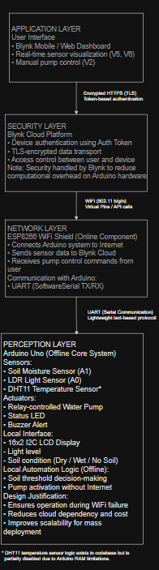
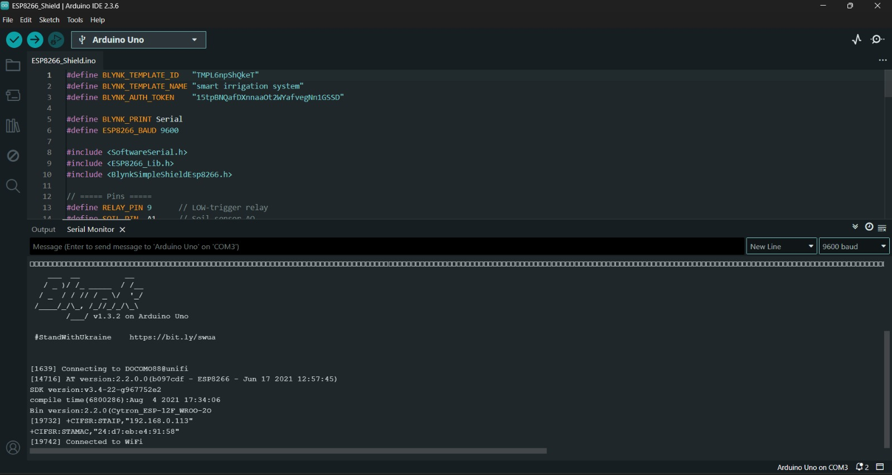
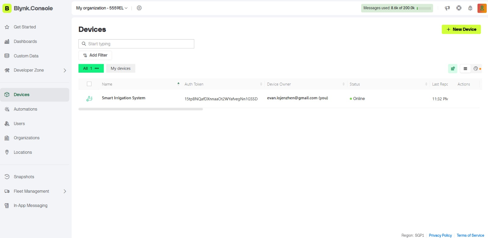
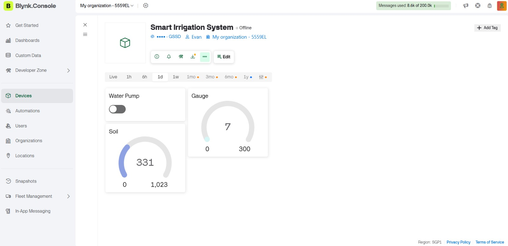

# Smart Irrigation System (AquaSense)

## 1. Project Overview

The **Smart Irrigation System (AquaSense)** is a hybrid Internet of Things (IoT) solution designed for automated garden irrigation with **both offline autonomy and online cloud connectivity**. The system monitors environmental conditions—primarily soil moisture and ambient light—and controls a water pump using rule-based automation. Remote monitoring and manual override are provided through the **Blynk IoT cloud platform**, while a local LCD ensures continuous usability during network failures.

The architecture follows a **layered IoT model**, separating perception, network, application, and security responsibilities to improve reliability, scalability, and maintainability.

### Key Features
- Real-time soil moisture and light intensity monitoring  
- Autonomous irrigation using threshold-based control logic  
- Offline operation with local LCD feedback  
- Online monitoring and pump control via Blynk  
- Secure cloud communication using token-based authentication  
- Modular design supporting future sensor and zone expansion  

---

## 2. System Architecture

### Architecture Overview (IoT Layered Model)

<p align="center">
  <br>
  <em>Figure: Layered IoT Architecture of the Smart Irrigation System</em>
</p>

---

### IoT Layer Description

#### Application Layer
- **Blynk Mobile / Web Dashboard**
  - Real-time visualization of sensor data (Virtual Pins V5, V6)
  - Manual pump control via virtual switch (V2)
  - Data logging, notifications, and remote access

---

#### Security Layer
- **Blynk Cloud Platform**
  - Device authentication using a unique Auth Token
  - TLS-encrypted communication channels
  - Access control between user, cloud, and device

**Design Rationale:**  
Security is delegated to the cloud layer to reduce cryptographic and memory overhead on Arduino hardware.

---

#### Network Layer
- **ESP8266 WiFi Shield**
  - Provides TCP/IP connectivity over IEEE 802.11 b/g/n
  - Handles Internet communication with Blynk Cloud
  - Transmits sensor data and receives control commands

**Arduino ↔ ESP8266 Communication**
- UART serial interface (SoftwareSerial)
- Baud rate: 9600 bps

---

#### Perception Layer
- **Arduino Uno (Offline Core Controller)**

**Sensors**
- Soil Moisture Sensor (Analog A1)
- LDR Light Sensor (Analog A0)
- DHT11 Temperature Sensor *(future use)*

**Actuators**
- Relay-controlled water pump
- Status LED
- Buzzer for alert notifications

**Local Interface**
- 16×2 I2C LCD  
  - Soil condition (Dry / Wet / No Soil)  
  - Light intensity  
  - System status  

**Offline Automation Logic**
- Threshold-based irrigation decision-making
- Pump control independent of Internet availability

**Design Justification**
- Ensures uninterrupted irrigation during WiFi outages
- Reduces cloud dependency and operational cost
- Enables safe failover behavior

---

## 3. Hardware Components

| Component | Function |
|---------|---------|
| Arduino Uno | Core processing and control unit |
| ESP8266 WiFi Shield | Internet and cloud connectivity |
| Soil Moisture Sensor | Measures soil water content |
| LDR | Detects ambient light intensity |
| DHT11 | Temperature sensing (future use) |
| Relay Module (Active LOW) | Controls water pump |
| 16×2 I2C LCD | Local system monitoring |
| LED & Buzzer | Visual and audible alerts |

---

## 4. Software Architecture

### Arduino (Offline Control Logic)
1. Read soil moisture and light intensity values.
2. Evaluate soil condition:
   - **Dry Soil:** Below threshold → Pump ON
   - **Wet Soil:** Above threshold → Pump OFF
   - **No Soil / Sensor Error:** Extreme values → Pump OFF + alert
3. Update LCD with real-time sensor readings and system state.
4. Transmit sensor data to ESP8266 via UART.

---

### ESP8266 (Online Cloud Interface)
1. Connect to WiFi using configured credentials.
2. Authenticate with Blynk Cloud using Auth Token.
3. Upload sensor readings to Blynk virtual pins.
4. Receive pump control commands from Blynk (V2).
5. Coordinate with Arduino while preserving offline safety logic.

---

## 5. Networking Protocols

- **Arduino ↔ ESP8266:** UART (SoftwareSerial), 9600 baud  
- **ESP8266 ↔ Cloud:** TCP/IP over WiFi  
- **Application Protocol:** Blynk virtual pin abstraction  

**Data Flow**
- Sensors → Arduino → ESP8266 → Blynk Cloud → User  
- User → Blynk Cloud → ESP8266 → Arduino → Relay  

---

## 6. Security Implementation

1. Token-based device authentication (Blynk Auth Token)
2. TLS-encrypted cloud communication
3. Fail-safe offline automation during network outages

---

## 7. Installation and Step-by-Step Setup

### Hardware Setup
1. Soil moisture sensor → `A1`
2. LDR → `A0`
3. DHT11 → `A2`
4. Relay module → `D9` (Active LOW)
5. LED → `D7`
6. Buzzer → `D8`
7. I2C LCD → SDA (`A4`), SCL (`A5`)
8. ESP8266 shield stacked or connected via:
   - RX → Pin 2  
   - TX → Pin 3  

---

### Software Setup
1. Install Arduino IDE.
2. Install required libraries:
   - LiquidCrystal_I2C
   - DHT
   - SoftwareSerial
   - ESP8266_Lib
   - Blynk
3. Configure WiFi credentials:
   ```cpp
   char ssid[] = "Your_SSID";
   char pass[] = "Your_Password";

4. Update Blynk Auth Token:
   ```cpp
   #define BLYNK_AUTH_TOKEN "Your_Blynk_Token"

5. Upload Arduino offline code to Arduino.

6. Upload ESP8266 Blynk code to Arduino (via shield).

7. Open Blynk mobile app, configure virtual pins:

- V2 → Pump Switch

- V5 → Soil Moisture

- V6 → Light Intensity

7. Power the system, monitor LCD, and verify Blynk cloud readings.

---

### Testing & Results

- Sensor readings are checked using Serial Monitor and LCD output.

- Pump responds to:

   -  Soil moisture thresholds offline

   - Manual override via Blynk online

- Alerts via buzzer and LED for abnormal soil conditions.

- Data uploaded to Blynk app every 1 second.

**Observations:**

- Offline LCD ensures responsible IoT design: users can monitor irrigation even if WiFi fails.

- Online cloud control enables remote monitoring, data logging, and manual override.

---
## System Interface & Deployment Evidence

This section documents the **user-facing dashboard**, **physical hardware implementation**, and **simulation environment** used to validate the Smart Irrigation System.  
These artifacts provide visual and technical evidence of correct system behavior across online and offline modes.
## WiFi Connectivity Verification (ESP8266 Shield)

Successful WiFi connectivity is a prerequisite for cloud-based monitoring and control.  
This system uses an **ESP8266 WiFi shield** authenticated through the Blynk platform using a **unique device token** and encrypted communication.

### Connection Indicators
- ESP8266 successfully joins the configured WiFi network.
- Blynk cloud authentication completes using token-based authorization.
- Device transitions into **online mode**, enabling dashboard synchronization.
- Sensor data begins streaming to virtual pins (V5, V6).

### WiFi Connection Evidence



*Figure: ESP8266 WiFi shield successfully connected to the network and authenticated with the Blynk cloud.*

---

### Operational Note
If WiFi connectivity is lost:
- The Arduino continues executing **offline irrigation logic**.
- The LCD remains active for local monitoring.
- Once connectivity is restored, the system resumes cloud synchronization automatically.

This behavior reinforces the system’s **hybrid online–offline architecture** and supports reliable operation under real-world network conditions.

---

## Blynk System Dashboard

The Blynk dashboard serves as the **application-layer interface**, enabling remote monitoring and manual control while relying on secure cloud communication.

### Dashboard Functions
- **Manual Pump Control (V2):** Allows users to override local automation logic when connected online.
- **Soil Moisture Visualization (V5):** Displays real-time soil readings transmitted from the Arduino.
- **Light Intensity Visualization (V6):** Shows ambient light levels captured by the LDR sensor.

### Dashboard Screenshot


*Figure: Blynk cloud dashboard showing device selection.*



*Figure: Blynk cloud dashboard showing real-time sensor values and pump control.*

---

## Physical System Implementation

The deployed prototype uses a **stacked Arduino Uno and ESP8266 WiFi shield configuration**, allowing compact integration while preserving modular control and communication layers.

### Key Implementation Notes
- Local automation logic executes entirely on the Arduino.
- ESP8266 handles WiFi connectivity and secure communication with Blynk.
- UART (SoftwareSerial) is used for bidirectional data exchange between devices.
- The I2C LCD provides continuous local feedback, even during WiFi outages.

### Physical Prototype Image

<p align="center">
  
</p>


*Figure: Physical Smart Irrigation System prototype with sensors, relay, LCD, and ESP8266 WiFi shield.*

---

## Tinkercad Simulation Environment

A Tinkercad simulation was developed to validate system logic prior to physical deployment.


*Figure: Smart Irrigation System prototype with sensors, relay, LCD, and ESP8266 WiFi shield on Tinkercad.*

### Simulation Scope
- Sensor value variation testing (dry, wet, no-soil conditions).
- Relay activation logic verification.
- LCD output correctness.
- Serial output used as debugging and assessment evidence.

> Cloud functionality is excluded from the simulation due to platform limitations; only the **offline control logic** is represented.

### Tinkercad Project Link

🔗 **Simulation Access:**  
https://www.tinkercad.com/things/aVYDV8tfps9-powerful-snaget?sharecode=RKqX7NYL6OGC1aawH5w4ol8vZsX6XXC6hOB-PDlpacA

---

## Verification Summary

The combination of:
- **Cloud dashboard**
- **Physical prototype**
- **Simulation-based testing**

ensures the system is:
- Technically verifiable
- Fault-tolerant
- Aligned with responsible IoT design principles
- Suitable for scalable real-world deployment


### Future Work

- Unified Online-Offline Mode: Automatic sync between offline Arduino and Blynk cloud.

- Additional Sensors: Temperature-based irrigation (DHT), rain detection, water-level sensors.

- Multi-Zone Irrigation: Support multiple pumps and relays.

- Adaptive Logic: Use historical data for dynamic irrigation thresholds.

- Enhanced Dashboard: Include analytics and alerts.

---

### References

Blynk Inc. (2024). Blynk Documentation: IoT Platform Overview and Virtual Pin API.
Available at: https://docs.blynk.io/

Arduino. (2024). Arduino Uno Rev3 – Technical Specifications.
Available at: https://docs.arduino.cc/hardware/uno-rev3

Adafruit Industries. (2023). DHT11 Temperature and Humidity Sensor Datasheet.
Available at: https://learn.adafruit.com/dht

Arduino. (2024). LiquidCrystal I2C Library Documentation.
Available at: https://www.arduino.cc/reference/en/libraries/liquidcrystal-i2c/

Espressif Systems. (2023). ESP8266 AT Instruction Set and Communication Protocol.
Available at: https://www.espressif.com/en/products/socs/esp8266

IEEE. (2022). IEEE 2413–2019: Standard for an Architectural Framework for the Internet of Things (IoT).
IEEE Standards Association.

---

### Notes

This project demonstrates responsible IoT engineering, balancing cloud convenience with local autonomy.

Hybrid online-offline architecture reduces downtime and supports future scaling.